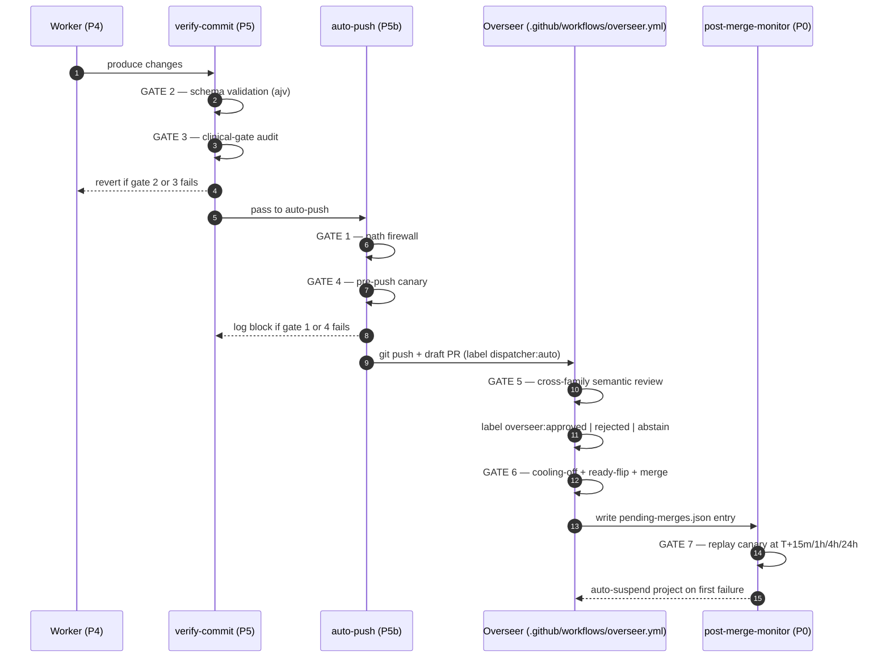

# Dispatcher Overview

**A reader-on-ramp to the budget-dispatcher, its seven-gate auto-merge stack, its hardening pile, the Veydria pillar architecture it sits inside, and the 13 Phase 2 ADR candidates awaiting operator decision.**

| Audience | Read time | If you only read one section |
|---|---|---|
| Returning Perry after weeks-away | ~25 min full / 5 min skim | [§11 TL;DR](#11--tldr-and-how-to-use-this-doc) |
| New contributor coming in cold | ~30 min full | [§3 Seven-gate stack](#3--the-seven-gate-auto-merge-stack-headline-section) |
| Operator triaging an alert | ~5 min direct | [§10 Operator workflows](#10--operator-workflows-common-scenarios) |

**Reference state:** combo `06241bb` · claude-budget-dispatcher `dc8004c` · worldbuilder `3b45a15` · dated 2026-05-06.

> **What's changed since the 2026-05-03 ship:** Phase 2 ADR decisions recorded (M4+H1+H7+H2 adopted as first-ship set; M3/H4/H5-full deferred per cross-synthesis META-LESSON). M4 wave 1 (drift detector) **code shipped** 2026-05-03 late-night (runtime dormant pending ONNX model download). Fix #1 (T1-A forensics writer) shipped 2026-05-04 + Fix #2 (codestral-as-autofix substitute, dispatcher `dc8004c`) shipped 2026-05-05. Rounds 1-14 of the post-fallback follow-ups monitoring arc closed; verdict on Fix #2 verification: outcome (c) holds 3rd consecutive round (substitute mechanism dormant-but-ready; no codestral-fallback fix-parse-failed events captured post-`dc8004c`). B3 volatility cycle 8-rounds-confirmed and operator-canonicalized as permanent operational behavior. See [§7 status snapshot](#status-snapshot-2026-05-06) below.

---

## Table of contents

1. [What the dispatcher is and what it isn't](#1--what-the-dispatcher-is-and-what-it-isnt)
2. [Topology and the dispatch lifecycle](#2--topology-and-the-dispatch-lifecycle)
3. [The seven-gate auto-merge stack](#3--the-seven-gate-auto-merge-stack-headline-section)
4. [The four-pillar Veydria architecture context](#4--the-four-pillar-veydria-architecture-context)
5. [Error handling and observability](#5--error-handling-and-observability)
6. [Cross-machine fleet topology](#6--cross-machine-fleet-topology)
7. [The 13 Phase 2 ADR candidates (pointer surface)](#7--the-13-phase-2-adr-candidates-pointer-surface)
8. [Configuration: layered shared.json + local.json + schema](#8--configuration-layered-sharedjson--localjson--schema)
9. [Tests, CI, and the meta-loop](#9--tests-ci-and-the-meta-loop)
10. [Operator workflows: common scenarios](#10--operator-workflows-common-scenarios)
11. [TL;DR and how-to-use-this-doc](#11--tldr-and-how-to-use-this-doc)
12. [Reference: canonical-doc map and glossary](#12--reference-canonical-doc-map-and-glossary)

---

## 1 — What the dispatcher is and what it isn't

**The dispatcher** is opportunistic infrastructure for turning unused free-tier AI quota into bounded, reversible, reviewable code work on Perry's own projects while he is away from the keyboard. It runs every 20 minutes via Windows Task Scheduler on three machines (PC + Optiplex + Neighbor), picks one project from a small rotation list, picks one pre-approved task from that project's `DISPATCH.md`, executes the task in a worktree, and either commits to an `auto/*` branch (today) or pushes a draft PR through a seven-gate auto-merge stack (when opted-in per project).

**What it is:**
- **Bounded** — pre-approved tasks on pre-approved projects, allowlisted by path
- **Reversible** — work happens on `auto/*` branches; merges go through draft-PR + cooling-off + post-merge canary; nothing touches `main` directly
- **Reviewable** — every commit gets a structured JSONL log entry; every PR gets a cross-family semantic review label

**What it isn't:**
- **Not a CI/CD system** — no SLA, no on-call rotation, fails closed on any ambiguity
- **Not a replacement for human review** — the seven-gate stack is opt-in per project; default-to-block invariants protect everywhere
- **Not multi-tenant** — Perry's toolchain, with per-machine `local.json`, gitignored secrets, hardcoded paths in scheduled tasks

**Canonical "why" doc:** [docs/VISION.md](VISION.md) (~50 lines) covers the design principles, the dependency chain (dispatcher → worldbuilder → physics engine → Frontier game), and what 12-month success looks like. **Strategic horizons:** [docs/STRATEGIC-ROADMAP-2026-04-24.md](STRATEGIC-ROADMAP-2026-04-24.md) covers the 4-horizon plan (Stabilize → Harden → Scale → Self-Improve), with the caveat that some milestone-status text is stale (e.g., "fleet idle 22h" was 2026-04-24; today the fleet runs ~97 cycles per 24h across three machines).

---

## 2 — Topology and the dispatch lifecycle

**Repo layout (skimmed):**

```
claude-budget-dispatcher/
├─ scripts/                 entry points (dispatch, overseer, watchdog, status, fleet, control, dashboard)
│  ├─ run-dispatcher.ps1    PowerShell wrapper for Task Scheduler (estimator → idle gate → dispatch)
│  ├─ dispatch.mjs          THE dispatch orchestrator (Phase -1 through Phase 5b)
│  ├─ overseer.mjs          gates 5+6 — runs in GitHub Actions every 2h
│  ├─ post-merge-monitor.mjs gate 7 — invoked from Phase 0 of dispatch.mjs
│  ├─ watchdog.mjs          P7 fleet-silence — runs in GitHub Actions every 30m
│  └─ lib/                  ~30 modules + 28 test files (Node.js native test runner)
├─ config/                  shared.json (committed) + local.json (gitignored) + budget.schema.json
├─ docs/                    VISION, OPERATOR-GUIDE, AUTO-PUSH, AUTO-MERGE, OVERSEER, WATCHDOG,
│                           FLEET-OPS, STRATEGIC-ROADMAP, research/ (Phase 2 syntheses), this doc
├─ status/                  runtime state — JSONL log, last-run marker, health snapshot, fleet/*.json
├─ state/                   per-machine ephemeral state — circuit-breaker counter
└─ .github/workflows/       overseer.yml + watchdog.yml
```

**The dispatch lifecycle:** every 20 minutes, [scripts/run-dispatcher.ps1](../scripts/run-dispatcher.ps1) wakes, runs the budget estimator, checks user idle time, and if everything is green spawns [scripts/dispatch.mjs](../scripts/dispatch.mjs). That script runs phases in this strict order:

```
                                                                              token cost  fail mode
  Phase -1   Heartbeat push          → status gist                            0 tokens    fail-soft
  Phase -0.5 Sentinel                → dead-node detection (3-miss)           0 tokens    fail-soft
  Phase 0    Post-merge monitor      → GATE 7 canary replays                  0 tokens    fail-soft
  Phase 0.5  Scaffold check          → DISPATCH.md present per project        0 tokens    fail-soft
─── budget gate boundary ─────────────────────────────────────────────────────────────────────────
  Phase 1    Gates                   → PAUSED, budget, idle, daily-quota      0 tokens    skip-on-fail
  Phase 2    Selector                → Gemini 2.5 Flash picks (project, task) ~2-5K free  fall-through
  Phase 3    Router                  → task-class → model resolution          0 tokens    skip-on-fail
  Phase 4    Worker                  → execute work in worktree              free-tier   revert-on-fail
  Phase 5    Verify + commit         → GATES 2+3 (schema + clinical)         (audit toks) revert-on-fail
  Phase 5b   Auto-push               → GATES 1+4 (firewall + canary) + draft PR  -        block-on-fail
```

Phases before P1 run on every cycle, regardless of budget gate state — that's by design: heartbeat + post-merge-replay + scaffold-check are operational invariants that must fire even when the dispatcher is "skipping" the work. Phase 1 is where most cycles exit (today, ~97 cycles/24h fire across the fleet but most block at gate 1 of Phase 5b — `outside-allowlist` or `disabled-project` — because most rotation projects haven't opted into auto-push yet; this is working as designed).

**Per-phase entry points** (file:function pointers, all on dispatcher `1a91073`):

| Phase | File:function | What it does on success |
|---|---|---|
| P-1 | [scripts/lib/heartbeat.mjs](../scripts/lib/heartbeat.mjs)`:pushHeartbeat` | Writes `fleet-<hostname>.json` to status gist |
| P-0.5 | [scripts/lib/sentinel.mjs](../scripts/lib/sentinel.mjs)`:runSentinel` | Re-queues orphaned tasks from dead nodes |
| P0 | [scripts/post-merge-monitor.mjs](../scripts/post-merge-monitor.mjs)`:runPostMergeMonitor` | See [§3 gate 7](#3--the-seven-gate-auto-merge-stack-headline-section) |
| P0.5 | [scripts/lib/scaffold.mjs](../scripts/lib/scaffold.mjs)`:verifyProjectScaffolds` | Logs `scaffold-missing` per project |
| P1 | [scripts/lib/gates.mjs](../scripts/lib/gates.mjs)`:runGates` | Returns `{ proceed, reason }`; node engine bypasses budget gate |
| P2 | [scripts/lib/selector.mjs](../scripts/lib/selector.mjs)`:selectProjectAndTask` | Returns `{ project, task, taskClass, pipelineStep? }` |
| P3 | [scripts/lib/router.mjs](../scripts/lib/router.mjs)`:resolveModel` | Returns `{ delegate_to, model, auditModel }` |
| P4 | [scripts/lib/worker.mjs](../scripts/lib/worker.mjs)`:executeWork` | Generates code/tests/docs in worktree |
| P5 | [scripts/lib/verify-commit.mjs](../scripts/lib/verify-commit.mjs)`:verifyAndCommit` | Tests, clinical-gate audit, commits, restores pushurl |
| P5b | [scripts/lib/auto-push.mjs](../scripts/lib/auto-push.mjs)`:maybeAutoPush` | See [§3 gates 1+4](#3--the-seven-gate-auto-merge-stack-headline-section) |

**Companion reference:** [combo/docs/DISPATCHER-MAP.md](../../combo/docs/DISPATCHER-MAP.md) is the one-screen table-driven sibling to this doc. Read it after §2 if you want a denser inventory of every supporting library module (alerting, cache, throttle, gist-lock, scan, schemas, etc.) without the narrative.

---

## 3 — The seven-gate auto-merge stack (headline section)

The **seven-gate stack** is the load-bearing architecture for autonomous code merging. It exists because Perry's design philosophy is "every individual gate is allowed to be wrong; the *stack* is what's correct." A PR moves through gates 1→7 sequentially; failure at any gate blocks progression and surfaces a labeled signal for operator review.



**Gate-by-gate reference:**

| # | Role | Implementation | Status | Opt-in flag | Canonical doc |
|---|---|---|---|---|---|
| 1 | Path firewall (allowlist globs) | [auto-push.mjs](../scripts/lib/auto-push.mjs)`:evaluatePathFirewall` | Shipped 2026-04-26 | `auto_push:true` + `auto_push_allowlist[]` | [AUTO-PUSH.md](AUTO-PUSH.md) |
| 2 | Worker schema validation (ajv) | [worker.mjs](../scripts/lib/worker.mjs)`:executeWork` | Always-on | (implicit) | (inline) |
| 3 | Clinical-gate audit | [verify-commit.mjs](../scripts/lib/verify-commit.mjs)`:verifyAndCommit` | Always-on | per-project `clinical_gate:true` | (inline) |
| 4 | Pre-push canary | [auto-push.mjs](../scripts/lib/auto-push.mjs)`:_defaultCanaryRunner` | Shipped 2026-04-26 | `canary_command:[…]` | [AUTO-PUSH.md](AUTO-PUSH.md) |
| 5 | Cross-family semantic review | [overseer.mjs](../scripts/overseer.mjs)`:reviewOnePr` | Shipped 2026-04-27 | `overseer.enabled:true` + `repos[]` | [OVERSEER.md](OVERSEER.md) |
| 6 | Cooling-off + ready-flip + merge | [overseer.mjs](../scripts/overseer.mjs)`:evaluateCoolingOff` | Shipped 2026-04-28 | `auto_merge:true` (fleet + project) | [AUTO-MERGE.md](AUTO-MERGE.md) |
| 7 | Post-merge canary replay | [post-merge-monitor.mjs](../scripts/post-merge-monitor.mjs)`:runPostMergeMonitor` | Shipped 2026-04-28 | active when entries in pending-merges | [AUTO-MERGE.md](AUTO-MERGE.md) |

**Per-gate narrative:**

**Gate 1 — Path firewall.** Compares the changed-files list against the project's `auto_push_allowlist` globs (default-empty). Files that don't match any allowlist glob block the push with `outside-allowlist`. Files that match a never-auto-push protected glob (e.g., `.github/**`, `package.json`, secrets paths) block the push regardless. Default-to-block: a project without an allowlist never auto-pushes, even if `auto_push:true`.

**Gate 2 — Worker schema validation.** The LLM's structured output (filename + content + diff hint) is validated against an ajv JSON Schema before any file write. Catches truncated Flash output (P4 design lesson 2026-04-16: `hasBalancedDelimiters` brace-balance check) and malformed structured responses. Fails revert the worker step entirely.

**Gate 3 — Clinical-gate audit.** When a project marks `clinical_gate:true` (currently burn-wizard, wilderness, medilex), any touch under `domain/` or `src/data/` triggers an independent cross-family LLM audit via [pal codereview](../scripts/lib/verify-commit.mjs) before the commit lands. Critical findings revert the commit + log a `clinical-gate-revert` outcome.

**Gate 4 — Pre-push canary.** Runs the project's `canary_command` (e.g., `["npm.cmd","test"]` on Windows) inside the worktree before `git push`. Failure (non-zero exit, timeout, or spawn error) blocks the push and preserves the local commit/branch. Three-layer security model: AJV schema + runtime type check + array-form spawn (prevents shell-injection). Bug F (2026-04-27 DECISIONS) added platform-aware `shell:true` for `.cmd`/`.bat` on Windows only.

**Gate 5 — Cross-family semantic review.** The Overseer GitHub Actions cron (every 2h) finds open draft PRs labeled `dispatcher:auto`, runs the diff through a model from the *opposite* family (Gemini-generated → Mistral-audited; Mistral-generated → Gemini-audited; this is the C-1 cross-family discipline from DECISIONS 2026-04-14), and applies one of three labels: `overseer:approved`, `overseer:rejected`, `overseer:abstain`. Quota → abstain (not rejected). Read-only by default.

**Gate 6 — Cooling-off + ready-flip + merge.** When `auto_merge:true` at both fleet (`shared.json`) and project layers, the Overseer waits `cooling_off_minutes` (default 45) after `overseer:approved`, then ready-flips the PR via GraphQL `markPullRequestReadyForReview` and squash-merges via `PUT /pulls/{n}/merge`. Five default-to-block invariants enforce safety: (a) `auto_merge:true` at both layers, (b) approval matches current head SHA, (c) cooling-off elapsed, (d) no human comment after approve, (e) PR was draft when cooling-off expired. See [AUTO-MERGE.md](AUTO-MERGE.md) for the full state diagram.

**Gate 7 — Post-merge canary replay.** Phase 0 of every dispatch tick reads `pending-merges.json` from the gist, finds entries with deadlines elapsed, and replays the project's canary at T+15m / T+1h / T+4h / T+24h post-merge. Single failure → auto-suspend project's `auto_push:false` + ntfy priority-5 alert + entry marked `completed:true outcome:auto-suspended`. **No auto-recovery** — operator manually flips back. Validates regressions that pass at merge time but surface later (delayed semantic defects, environment-specific bugs).

**What's actually firing in production today** (per ai/STATE.md 2026-05-03):
- **Gate 1+4:** dormant on most rotation projects; active on `sandbox-workflow-enhancement` (auto_push:true since 2026-04-26) and `sandbox-canary-test` (auto_push:true added 2026-04-29 PM).
- **Gate 2+3:** always-on; fire on every dispatched commit.
- **Gate 5:** read-only on `pmartin1915/extra-sub-standalone-canary-test` only (overseer enabled 2026-04-29 PM).
- **Gate 6:** dormant fleet-wide (`auto_merge:false`).
- **Gate 7:** dormant (no entries in pending-merges since the 2026-04-27 closure smoke completed).

The mechanism is **CODE-COMPLETE end-to-end and operationally validated** against canary PRs #46 + #47 in 2026-04-27 / 2026-04-28 — but real-rotation-project opt-in waits on operator decision (`sandbox-workflow-enhancement` is the recommended first opt-in for ~3 clean cycles; clinical projects need additional gate hardening before they qualify).

---

## 4 — The four-pillar Veydria architecture context

The dispatcher is not a standalone end. It's the substrate for a longer dependency chain culminating in the eventual Veydria worldbuilder + Frontier game. Perry's [worldbuilder/VEYDRIA-VISION.md](../../worldbuilder/VEYDRIA-VISION.md) frames this as a four-pillar architecture; the dispatcher is Pillar 0.

```
Pillar 0: Hardened fleet                                        [SHIPPED]
 │   (the budget-dispatcher you're reading about)
 │
 ├─ Pillar 1: Auto-push gate stack                              [CODE-COMPLETE, dormant]
 │   (the seven-gate stack from §3; mechanism live, opt-in awaits)
 │
 ├─ Pillar 2: Canon index
 │   ├─ Phase 1: Static canon-canary primitive                  [SHIPPED 2026-04-28]
 │   │   (worldbuilder/scripts/canon-canary.mjs; 142 entities indexed)
 │   └─ Phase 2: RAG layer (vector store + embedding queries)   [DEFERRED]
 │
 └─ Pillar 3: Overseer + drift detection
     ├─ Gate 5 cross-family review                              [SHIPPED 2026-04-27 read-only]
     ├─ Gate 6+7 auto-merge mechanics                           [SHIPPED 2026-04-28 dormant]
     └─ Drift detector (M4 from Phase 2 syntheses)              [DEFERRED — phase 2 first ship]
```

**The autonomy boundary** (load-bearing principle, codified in VEYDRIA-VISION.md): the dispatcher is allowed to act autonomously on **objective-correctness work** (engine, physics, visualization, schema validation, canon-canary) where a test suite or static checker can grade the output. It is forbidden from acting autonomously on **creative-judgment work** (lore, dialogue, narrative design, world-state, clinical content) where correctness is operator-judgment. Hybrid repos (worldbuilder, burn-wizard) handle this via **path firewall** (gate 1 of the seven-gate stack): autonomous on safe paths, human-only on canon/domain paths.

**Pillar 2 Phase 1 detail.** [worldbuilder/scripts/canon-canary.mjs](../../worldbuilder/scripts/canon-canary.mjs) is a deterministic frontmatter validator that plugs into the dispatcher's gate-4 canary slot (via `canary_command` config). It reads a pre-committed `design/narrative-schema/canon.json` (142 entities indexed) and validates new content against the canonical entity registry. Catches the highest-frequency hallucination class (new civ names, malformed namespaces, duplicate ids) at the canary layer before it can merge. **This is the template clinical projects will reuse**: same primitive, different vocabulary list (SNOMED-CT, Holliday-Segar thresholds, contraindication whitelists) — see [combo/ai/DECISIONS.md](../../combo/ai/DECISIONS.md) `2026-04-28 — Pillar 2 Phase 1` entry for the full canonicalization.

**Pillar 3 detail.** Gate 5 is operationally green at the read-only label-only layer; gates 6+7 are code-complete but dormant. **The drift detector (M4)** from the 2026-05-03 metacognition synthesis is the load-bearing missing piece — it adds semantic-content-layer drift detection (vector embedding + EMA + cosine threshold) on top of the existing 4-state outcome-rule classifier in [health.mjs](../scripts/lib/health.mjs). See [§7](#7--the-13-phase-2-adr-candidates-pointer-surface).

**Canonical doc:** [worldbuilder/VEYDRIA-VISION.md](../../worldbuilder/VEYDRIA-VISION.md). Do not re-document the pillar architecture in the dispatcher repo; this section is a pointer surface.

---

## 5 — Error handling and observability

The dispatcher fails closed at every layer. Beyond fail-closed, the observability stack is what lets a single operator catch silent failures across three machines without active monitoring.

```
 In-band detection (runs inside dispatch.mjs):
  ├─ health.mjs       — 4-state classifier (down / degraded / idle / healthy)
  ├─ provider.mjs     — C1 quota detection (HTTP 429 + body match)
  ├─ health.mjs       — C2 fallback-rate degraded (≥3 of last 6 cycles fell back)
  └─ context.mjs      — C3 per-project cooldown after consecutive failures

 Wrapper integrity (runs in run-dispatcher.ps1):
  └─ circuit-breaker.mjs — P3 wrapper auto-update freeze (3 post-pull failures → freeze)

 Out-of-band detection (runs in GitHub Actions, separate failure domain):
  ├─ watchdog.mjs (workflows/watchdog.yml)  — P7 fleet-silence detection (every 30m)
  └─ overseer.mjs (workflows/overseer.yml)  — gate 5 cron (every 2h)

 Operator surfaces:
  ├─ status/budget-dispatch-log.jsonl    — append-only structured outcomes (per-cycle)
  ├─ GitHub Gist (status board)          — fleet-synced heartbeats + pending-merges
  ├─ ntfy push notifications             — priority 5 fatal, priority 3 warnings
  └─ docs/fleet-dashboard.html (PWA)     — visual surface for iPhone home-screen
```

**Per-detector reference:**

| Detector | File | Trips on | Action on trip |
|---|---|---|---|
| 4-state health classifier | [health.mjs](../scripts/lib/health.mjs) | ≥3 errors / >6h no success / structural skips | Surfaces state in `status/health.json` for dashboard + selector context |
| C1 quota detection | [provider.mjs](../scripts/lib/provider.mjs)`:isQuotaExhausted` | HTTP 429 with body containing "quota", "daily", "rate limit" | Returns abstain (not rejected); fall through to next candidate in fallback chain |
| C2 fallback-rate degraded | [health.mjs](../scripts/lib/health.mjs) | ≥3 of last 6 cycles used `deterministicFallback` | Escalates health from healthy → degraded; ntfy priority 3 |
| C3 per-project cooldown | [context.mjs](../scripts/lib/context.mjs)`:applyProjectCooldowns` | Consecutive failures on same project | Filters project out of selector for N minutes |
| P3 wrapper auto-update breaker | [circuit-breaker.mjs](../scripts/lib/circuit-breaker.mjs) | 3 consecutive post-pull dispatch failures | Freezes auto-update; ntfy priority 5; manual reset (`rm status/last-auto-pull.json`) |
| P7 fleet watchdog | [scripts/watchdog.mjs](../scripts/watchdog.mjs) + [.github/workflows/watchdog.yml](../.github/workflows/watchdog.yml) | Max heartbeat across fleet > 2h stale | Posts to separate ntfy topic on 30m cron |

**How to read the JSONL log** ([status/budget-dispatch-log.jsonl](../status/budget-dispatch-log.jsonl)):

Each line is one cycle's outcome. Five fields are load-bearing:

```jsonc
{"timestamp":"2026-05-03T18:55:32Z","engine":"dispatch.mjs","outcome":"skipped","phase":"phase-1","skip_reason":"weekly-reserve-floor-threatened","duration_ms":143}
{"timestamp":"2026-05-03T19:15:08Z","engine":"dispatch.mjs","outcome":"selector-failed","phase":"phase-2","reason":"gemini-quota-exhausted","duration_ms":421}
{"timestamp":"2026-05-03T19:35:22Z","engine":"dispatch.mjs","outcome":"success","phase":"phase-5b","project":"sandbox-workflow-enhancement","task":"audit","commit":"a73f1c2","auto_push":"pushed","duration_ms":78211}
{"timestamp":"2026-05-03T19:35:34Z","engine":"dispatch.mjs","outcome":"auto-push-blocked","phase":"phase-5b","project":"wilderness","reason":"outside-allowlist","duration_ms":1043}
```

- **`outcome`**: `success | skipped | error | auto-push-blocked | selector-failed | scaffold-missing | clinical-gate-revert`
- **`phase`**: `phase-1` through `phase-5b` (or pre-phase markers)
- **`skip_reason`**: meaningful only on `outcome:skipped`; values include `paused`, `user-active`, `weekly-reserve-floor-threatened`, `daily-quota-exhausted`, `mutex-contention`
- **`engine`**: `dispatch.mjs` (Node) or `claude-engine` (legacy Claude Max path)
- **`reason`**: free-text on errors; structured on common failure modes

**Fleet observability lives in the gist, not local JSONL.** The laptop (where Perry runs interactive Claude Code sessions) is monitor-only by design. The PC + Optiplex + Neighbor each push their per-cycle entries to their own local JSONL AND a heartbeat snapshot to the shared status gist. The fleet dashboard PWA ([docs/fleet-dashboard.html](fleet-dashboard.html), cache `fleet-v2`) reads the gist; iPhone Safari home-screen standalone mode is the intended surface.

**Canonical docs:** [WATCHDOG.md](WATCHDOG.md) (P7 setup + 2h threshold rationale), [OPERATOR-GUIDE.md](OPERATOR-GUIDE.md) (budget gate skip-reason vocabulary), [FLEET-OPS.md](FLEET-OPS.md) (gist-as-status-board, multi-machine ops).

---

## 6 — Cross-machine fleet topology

| Machine | Hostname | Role | Status (per ai/STATE.md 2026-05-03) |
|---|---|---|---|
| PC | `perrypc` | Active dispatcher | ~40 cycles / 24h |
| Optiplex | `desktop-tojgbg2` | Active dispatcher | ~34 cycles / 24h |
| Neighbor | `desktop-p7h5aj1` | Active dispatcher | ~23 cycles / 24h |
| Laptop | (varies) | Monitor-only by design | No scheduled task |

**Total ~97 cycles/24h fleet-wide** (PC ~40 + Optiplex ~34 + Neighbor ~23 averages ~32 per machine, well below the 96/day per-machine daily-quota cap; the activity gate is filtering ~2/3 of attempts as user-active or contended). Most cycles that DO fire block at gate 1 (`outside-allowlist` or `disabled-project`) — gates working as designed pre-opt-in.

**Coordination model:**
- **Distributed lock** via gist ETag CAS in [scripts/lib/gist.mjs](../scripts/lib/gist.mjs) prevents two machines from dispatching simultaneously. The 2026-04-27 Bug E entry in [combo/ai/DECISIONS.md](../../combo/ai/DECISIONS.md) drops `If-Match` on PATCH (gists API rejects it with HTTP 400) and rebuilds concurrency around re-read confirmation; race window is ~ms with 20-min cron cadence.
- **Layered config:** [config/shared.json](../config/shared.json) (committed, fleet-wide defaults) merged with `config/local.json` (gitignored, per-machine overrides) materializes into in-memory effective config at startup. Validated against [config/budget.schema.json](../config/budget.schema.json). See [§8](#8--configuration-layered-sharedjson--localjson--schema).
- **Heartbeat sync** via [scripts/lib/heartbeat.mjs](../scripts/lib/heartbeat.mjs) pushes `fleet-<hostname>.json` to the status gist every cycle. Watchdog reads max heartbeat age across the fleet; > 2h stale → ntfy.

**Why the laptop is monitor-only:** Perry uses the laptop for interactive Claude Code sessions. Adding a scheduled dispatcher to the laptop would compete for `~/.claude/projects/**/*.jsonl` writes (the activity gate would constantly trip) and would add an inferior third dispatcher to a fleet that's already saturating the per-machine cap on the always-on machines. The laptop's role is observer + manual operator + interactive-session-host.

**Canonical doc:** [FLEET-OPS.md](FLEET-OPS.md) covers fleet health checks (3 ways: dashboard, CLI, gist direct), config deployment without RDP, per-slug override pattern, adding projects to rotation.

---

## 7 — The 13 Phase 2 ADR candidates (pointer surface)

The 2026-05-03 PM session shipped two complementary syntheses that surface 13 load-bearing dispatcher design decisions. They are awaiting operator decision; this section is a pointer surface, not re-documentation. The canonical framings live in the syntheses + the [combo/ai/DECISIONS.md](../../combo/ai/DECISIONS.md) `2026-05-03` entries.

### M-series (METACOGNITION synthesis)

Source: [docs/research/METACOGNITION-synthesis-2026-05-03.md](research/METACOGNITION-synthesis-2026-05-03.md). Synthesizes a Claude DESIGN + Claude red-team AUDIT pair (single-family with cross-check against running source as the third verification layer).

| ID | Title | Recommended path | Notes |
|---|---|---|---|
| M1 | Servy daemon adoption | Path (b) — defer Servy migration | Ship M4 alone first |
| M2 | Windows SCM timeout config | Path (c) — registry + wait-hints | Defer until M1 path (a) greenlit |
| M3 | LLM-driven AST self-repair | Path (b) — operator-mediated repair | Defer to Phase 3 |
| **M4** | **Drift-detector adoption + thresholds** | **ADOPT (LOAD-BEARING)** | Phase 2 first ship |
| M5 | Global watchdog: extend P7 lockdown | Path (a) — lockdown extension | After Pillar 1 opt-in |
| M6 | Repair-cascade prompt template | Defer with M3 | — |

### H-series (HARDENING-PHASE-2 synthesis)

Source: [docs/research/HARDENING-PHASE-2-synthesis-2026-05-03.md](research/HARDENING-PHASE-2-synthesis-2026-05-03.md). Synthesizes a Claude AUDIT (strategy) + Claude ROADMAP (tactics) pair.

| ID | Title | Recommended path | Notes |
|---|---|---|---|
| **H1** | **AST-entropy threshold + algorithm** | **ADOPT** | Phase 2 first trio |
| **H2** | **Mutation testing tool + thresholds** | **ADOPT** | Phase 2 first trio (after H1) |
| H3 | Sandbox tech for allowlist smokes | Forced ADOPT isolated-vm | Only if H4 path (a) |
| H4 | Probabilistic allowlist expansion | Path (b) — operator-edit-only | Defer to Phase 3 |
| H5 | Automated canary bisection | Interim path-a' (isolate, no auto-hotfix) | Phase 3 full |
| H6 | DCTD adoption | Path (b) — defer to Phase 3+ | — |
| **H7** | **Distributed-heartbeat upgrade** | **ADOPT with explicit scope** | Phase 2 first trio |

### The six named failure modes

- **MFM1 — coherence trap.** LLM agent retrieves irrelevant data, generates plausible-but-incorrect analysis. Defense: M4 drift detector.
- **MFM2 — Half-Open Loop.** Zombie patch passes mock validation, fails delayed in production. Defense: 4-state ACB with Probationary phase (per metacognition A1).
- **MFM3 — SCM 30s collision.** Servy SCM 30-second timeout silently overrides Pre-Launch hooks. Defense: dual-layered registry + wait-hints (per metacognition A2).
- **HFM1 — silent dispatch absorption.** Defense: `verifiedExec` pattern Phase 1 shipped + IPC watchdog timer extension partially shipped via dispatcher commit `4bbf348`.
- **HFM2 — conformity-bias error compounding.** Defense: deterministic semantic boundaries between agent handoffs (the H1+H2 Overseer-intelligence stack).
- **HFM3 — autonomous-loop-of-loops.** Defense: metacognition A1 4-state ACB; H5 path-(a) deferral collectively gated on this.

### Cross-synthesis interaction lesson

**H4 + H5 + M3 are collectively gated on M4 + the metacognition A1 ACB shipping first.** The autonomy mechanisms (probabilistic allowlist expansion, automated canary bisection, LLM-driven AST repair) all inherit MFM3/HFM3 autonomous-loop-of-loops risk. The safety mechanisms (drift detector M4 + 4-state ACB with Probationary state A1) must land first; only then do the autonomy mechanisms become defensible.

### Recommended Phase 2 first-ship set

Per both syntheses' downstream-actions sequencing: **M4 (drift detector) + H1 (AST entropy) + H7 (Sentinel extensions) + H2 (mutation testing)** as the smallest-risk-surface Phase 2 first-ship set (four items). M4 ships with soft-alert trip action for first 30 days (provisional threshold tuning); promote to hard-halt once false-positive rate is empirically characterized.

### Status snapshot (2026-05-06)

Operator decisions recorded 2026-05-03 evening at [`combo/docs/proposals/PHASE-2-ADR-DECISIONS-2026-05-03.md`](../../combo/docs/proposals/PHASE-2-ADR-DECISIONS-2026-05-03.md). All decisions matched synthesis recommendations.

| ADR | Decision | Implementation status |
|---|---|---|
| **M4** drift detector | ADOPTED, wave 1 | **Code shipped 2026-05-03** late-night (`drift-engine.mjs` + `drift-engine-cli.mjs` + 28 unit tests + Phase 0.1 wiring + ONNX A3 hardening). **Runtime dormant** — needs Perry to download ONNX model to `claude-budget-dispatcher/models/model_qint8_avx512_vnni.onnx`. Soft-alert trip action only for first 30 days. |
| **H1** AST entropy | ADOPTED, wave 2 | Not started. Paste-ready Sonnet prompt at [`PHASE-2-ADR-DECISIONS-2026-05-03.md`](../../combo/docs/proposals/PHASE-2-ADR-DECISIONS-2026-05-03.md). Sequenced after 30 days M4 soft-alert signal. |
| **H7** Sentinel upgrade | ADOPTED, wave 2 (parallel with H1) | Not started. Independent of H1 per HARDENING-PHASE-2 ROADMAP. |
| **H2** mutation testing | ADOPTED, wave 3 | Not started. Layers on H1 parser; sequenced after H1 lands. |
| H5 interim path-a' | ADOPTED, wave 4 (adopted-but-not-first-ship) | Not started. Bisection-only; explicitly does NOT auto-synthesize hotfix. |
| M1, M2, M3, M5, M6 | Deferred | Trigger conditions in DECISIONS entry. M5 lifts when first rotation project flips `auto_merge:true`. |
| H3, H4, H6 | Deferred | H3 conditional on H4. H4+H5-full+M3 collectively gated on M4 + metacognition A1 4-state ACB shipping first. H6 deferred to Phase 3+ or indefinitely. |

**Adjacent operational state (post-Phase-2-ship monitoring arc):**

- **Fix #1** (T1-A forensics writer extension at `worker.mjs:315` `fix-parse-failed` return path) — shipped 2026-05-04 (dispatcher commit `2914424`). Captures `fixedText` + `usedModel` for diagnostic forensics on autofix-pass parse failures.
- **Fix #2** (codestral-as-autofix substitute) — shipped 2026-05-05 (dispatcher commit `dc8004c`). When `usedModel` matches `^codestral` (case-insensitive), substitute `mistral-large-latest` for the autofix call. JSDoc + JSONL `autofix_model_override` field for observability.
- **Verification status (Rounds 12-14):** outcome (c) — substitute mechanism dormant but ready; zero codestral-fallback `fix-parse-failed` events captured in 36+h post-`dc8004c` window. Round 15 = 4-consecutive-round escalation threshold; if (c) still holds, operator-decision queued on whether to canonicalize the verification window as indeterminate.
- **`selector_fallback_count` oscillation 3-rounds-confirmed (5 → 3 → 4 across R12/R13/R14):** Gemini quota partially-recovering-and-re-exhausting dynamically; load-bearing operational pattern.
- **B3 volatility cycle 8-rounds-confirmed (Rounds 6/7/9/10/11/12/13/14):** rolling-window prune+re-add on `sandbox-canary-test` + `sandbox-workflow-enhancement`. Operator chose **leave-as-is at Round 14**; cycle is now permanently operational behavior, not a problem requiring fix.

**Implementation gates next:**

1. **Item: download M4 ONNX model.** Single Perry-hands-on step. Unblocks M4 runtime + starts the 30-day empirical-characterization window.
2. **Item: first real rotation project opt-in.** Recommended: `sandbox-workflow-enhancement`. Validates Pillar 1 path-firewall design under real free-tier-LLM load before any clinical opt-in. After ~3 clean cycles, opt-in expands.
3. **Wave 2 (H1+H7) launch:** triggers after 30 days of M4 soft-alert observation. Earliest: ~2026-06-05.
4. **Wave 3 (H2) launch:** after H1 lands.
5. **Wave 4 (H5 interim) launch:** after H2 stabilizes.

---

## 8 — Configuration: layered shared.json + local.json + schema

```
config/shared.json     (committed, fleet-wide defaults)
       ↓ merge
config/local.json      (gitignored, per-machine overrides)
       ↓ materialize at startup (config.mjs)
in-memory budget       (validated against config/budget.schema.json via ajv)
       ↓ used by every phase
config/budget.json     (legacy alias — kept for estimate-usage.mjs backward compat)
```

| File | Tracked | Who reads it | What lives there |
|---|---|---|---|
| [config/shared.json](../config/shared.json) | Yes | All machines | Default thresholds, rotation project list, `overseer.repos`, model `classes`, `fallback_chain` |
| `config/local.json` | No (gitignored) | This machine only | Per-machine: `auto_push`, `auto_push_allowlist`, `canary_command`, active PAL endpoint |
| [config/budget.schema.json](../config/budget.schema.json) | Yes | ajv at startup | JSON Schema (draft-07) for both shared + local |
| `config/budget.json` | Yes | `estimate-usage.mjs` (legacy) | Same schema; backward compat with Claude-prompt engine |

**Key schema fields for opt-in decisions:**

- **Top-level kill switch:** `auto_push:bool` (fleet-wide). Default `true`-armed but ineffective until per-project flag flips.
- **Per-project opt-in:** `projects_in_rotation[].auto_push:bool` (default false). Combined with `auto_push_allowlist[]` (path globs). Both required for gate 1 to allow a push.
- **Canary opt-in:** `canary_command:string[]` (argv form). Required for gate 4. Default-block: `auto_push:true` without `canary_command` → block with `canary-not-configured`.
- **Overseer opt-in:** `overseer.enabled:bool` + `overseer.repos:[…]` (mixed `string|object` form; bare strings keep `auto_merge:false`). Required for gate 5.
- **Auto-merge opt-in:** top-level `auto_merge:bool` AND per-repo object form `{owner_repo, auto_merge, merge_strategy, project_slug}` with `auto_merge:true`. Both required for gate 6.

**Kill-switch ladder** (fastest first):
1. **`touch config/PAUSED`** — instant. Estimator sees the file, sets `dispatch_authorized:false` immediately.
2. **Set `paused:true` in `config/local.json`** — persists across restarts.
3. **Flip top-level `auto_push:false` in shared.json** — disables push fleet-wide on next pull.
4. **Disable scheduled task** — dispatcher never runs at all.
5. **Delete `config/budget.json`** — estimator fails closed (exit code 2).

**Canonical docs:** [OPERATOR-GUIDE.md](OPERATOR-GUIDE.md) covers the full config field reference + budget math derivation. [FLEET-OPS.md](FLEET-OPS.md) covers fleet-wide config deployment without RDP.

---

## 9 — Tests, CI, and the meta-loop

**Test count:** 477/477 passing as of dispatcher commit `44b7c1d` (per ai/STATE.md). Three pre-existing flakes in [scripts/lib/__tests__/gates.test.mjs](../scripts/lib/__tests__/gates.test.mjs) carried since Bug F closure (`force flag bypasses activity gate`, `dry-run returns dryRun:true`, `daily quota uses config.max_runs_per_day`) were resolved in the test-pollution + Claude-Max-vocab fix.

**Testing model:**
- Node.js native test runner (no Jest, no Vitest); `npm test` walks [scripts/lib/__tests__/](../scripts/lib/__tests__/).
- 28 test files. Every load-bearing module has a corresponding `*.test.mjs` (worker, selector, gates, auto-push, circuit-breaker, health, post-merge-monitor, overseer, watchdog, gist, config, pipelines, heartbeat, sentinel, etc.).
- Pure functions are extracted with injectable I/O (matches the pattern from `gist.mjs:_readFn`, `circuit-breaker.mjs`, `watchdog.mjs`, `overseer.mjs`) so tests inject mocks rather than stubbing globals.

**Two GitHub Actions workflows:**

| File | Schedule | Role |
|---|---|---|
| [.github/workflows/overseer.yml](../.github/workflows/overseer.yml) | `*/2h` cron + `workflow_dispatch` | Gates 5+6 — semantic review + auto-merge progression |
| [.github/workflows/watchdog.yml](../.github/workflows/watchdog.yml) | `*/30m` cron + `workflow_dispatch` | P7 fleet-silence detection |

Both have `permissions:` minimized and CRITICAL audit-fixed against workflow command injection (env-var piping + bash array, no `${{ inputs.* }}` in script body).

**The cross-family audit discipline (C-1, DECISIONS 2026-04-14).** Generation and audit must use *different* model families to avoid shared-blind-spot monoculture. [scripts/lib/worker.mjs](../scripts/lib/worker.mjs)`:familyFor` derives the audit family from the generation family: Gemini-generated → Mistral-large; Mistral-generated → Gemini-2.5-pro; Codestral-generated → Gemini-2.5-pro; unknown families → abstain (no silent default). When Gemini's free-tier daily quota is exhausted, Mistral becomes the cross-family substitute (DECISIONS 2026-05-03 entries) — with the caveat that ~50% of Mistral's CRITICAL/HIGH/MEDIUM findings on close reading have been confidently-wrong misreads (per the precedent across both Phase 2 syntheses).

**Canonical docs:** [AUTO-MERGE.md](AUTO-MERGE.md) / [OVERSEER.md](OVERSEER.md) / [WATCHDOG.md](WATCHDOG.md) for workflow specifics.

---

## 10 — Operator workflows: common scenarios

*This section fills the gap surfaced by the 2026-05-03 docs inventory: existing canonical docs cover individual gates well, but no document walks an operator through cross-gate diagnosis.*

### "The fleet looks silent — what to check first"

1. **Watchdog ntfy topic.** If P7 detected fleet silence > 2h, you'll have a push notification on `WATCHDOG_NTFY_TOPIC`. Open it; the alert includes max heartbeat age + last-known per-machine timestamps.
2. **Status gist directly.** Run `node scripts/remote-status.mjs` from any machine, OR open the iPhone fleet dashboard PWA. Look for: which machines have heartbeats > 2h stale, which are healthy, what their last `outcome` was.
3. **Per-machine status/health.json.** RDP into the suspected-stuck machine; inspect [status/health.json](../status/health.json) for the 4-state classifier verdict. `down` ≥ 3 errors in last 6 cycles or > 6h no success with structural skips. `degraded` ≥ 3 fallbacks in last 6 cycles.
4. **Wrapper logs.** [status/dispatcher-runs/](../status/dispatcher-runs/) has one file per dispatch cycle (timestamp, exit code, stdout/stderr tail). The most recent few are the diagnosis surface.
5. **Circuit breaker state.** [status/last-auto-pull.json](../status/last-auto-pull.json) — if `frozen:true`, the wrapper auto-update freeze tripped (3 consecutive post-pull dispatch failures). Manual reset: `rm status/last-auto-pull.json` after fixing root cause.

Canonical procedure: [WATCHDOG.md](WATCHDOG.md) + [FLEET-OPS.md](FLEET-OPS.md).

### "A PR got `overseer:rejected` — what now"

1. **Read the audit comment.** The Overseer posts the cross-family audit verdict inline as a PR comment. The structured `findings[]` array surfaces criticals first.
2. **Operator decision tree:**
   - **Findings are correct + serious** → close the PR. The dispatcher's worktree is local; nothing was lost.
   - **Findings are correct + fixable** → push a fix commit to the same branch; the cooling-off + idempotency check fires re-review on next 2h cron tick.
   - **Findings are misreads (~50% rate per recent precedent)** → manually replace the label with `overseer:approved` (you have write permission per the workflow's `pull-requests: write`). Cooling-off begins; gate 6 will then fire in `cooling_off_minutes`.
   - **Quota exhausted (abstain)** → wait for next 2h cron tick when fallback family has fresh quota.
3. **Re-trigger manually.** If you need to re-fire mid-cron, use `gh workflow run overseer.yml -f pr_number=<N> -f repo=<owner/name>`. The workflow inputs are env-var-piped (no script-injection sink).

Canonical procedure: [OVERSEER.md](OVERSEER.md).

### "How to add a project to rotation"

1. **Scaffold DISPATCH.md** at the project's repo root (see [OPERATOR-GUIDE.md](OPERATOR-GUIDE.md) for the pre-approved-tasks table format).
2. **Add to `projects_in_rotation`** in [config/shared.json](../config/shared.json) with `auto_push:false` and empty `auto_push_allowlist:[]`. Commit + push so all fleet machines pick it up on next auto-pull.
3. **Run as observation-only** for at least ~3 dispatch cycles. Watch the JSONL log for `outcome:success` entries. The selector will surface the project naturally on activity gate green + cooldown clear.
4. **Opt into auto-push** (only after observation passes): set `auto_push:true` + populate `auto_push_allowlist:["docs/**", "tools/**", …]` in `local.json` first (single-machine validation), then promote to `shared.json` if clean. Add `canary_command` to satisfy gate 4's default-to-block invariant.
5. **Opt into Overseer** (gate 5 read-only): add the repo's `owner/name` to `overseer.repos[]` as a bare string (read-only by definition). Watch labels for ~3 review cycles before considering gate 6 opt-in.
6. **Opt into auto-merge** (gates 6+7): only after gate 5 ships ≥3 clean review cycles. Convert the bare-string entry to object form `{owner_repo, auto_merge:true, merge_strategy:"squash", project_slug}`. Set top-level `auto_merge:true`. **Clinical projects need additional clinical-gate hardening before they qualify** — burn-wizard / wilderness / medilex are not currently candidates.

Canonical procedure: [OPERATOR-GUIDE.md](OPERATOR-GUIDE.md) (DISPATCH.md format) + [FLEET-OPS.md](FLEET-OPS.md) (config deploy) + [AUTO-PUSH.md](AUTO-PUSH.md) + [AUTO-MERGE.md](AUTO-MERGE.md) (gate opt-in).

---

## 11 — TL;DR and how-to-use-this-doc

**If you only read one section…**
- **Understand the code:** [§3 seven-gate stack](#3--the-seven-gate-auto-merge-stack-headline-section).
- **Understand the operations:** [§10 operator workflows](#10--operator-workflows-common-scenarios).
- **Understand what's coming next:** [§7 13 ADR pointers](#7--the-13-phase-2-adr-candidates-pointer-surface).

**Common reader paths:**
- **Returning Perry** → §1 (state of the world) → §3 (gate stack recap) → §7 (Phase 2 next-decision surface). ~10 minutes.
- **New contributor** → §1 → §2 (topology) → §3 (gates) → §5 (observability) → linked operator guides. ~30 minutes.
- **Operator triaging an alert** → §10 (workflow walkthroughs) → §5 (which surface to check) → linked canonical-doc procedures. ~5 minutes direct.

**Doc maintenance.** This is a snapshot at 2026-05-03 against combo `4b765dc` / dispatcher `1a91073` / worldbuilder `03e9160`. For *current* state, always cross-reference [combo/ai/STATE.md](../../combo/ai/STATE.md) (most recent PM session entry) + recent git log. The seven-gate stack architecture and the four-pillar Veydria architecture are stable. The 13 ADR candidates change as operator decisions land. Test counts and fleet activity numbers drift continuously.

**Gentle reminder.** This doc is pointer-heavy by design — the operator guides remain canonical for their respective surfaces, the syntheses remain canonical for the 13 ADR canonical framings, [combo/docs/DISPATCHER-MAP.md](../../combo/docs/DISPATCHER-MAP.md) remains the one-screen tabular sibling. Don't re-document what already lives there; orient + link.

---

## 12 — Reference: canonical-doc map and glossary

### Canonical-doc map

| If you want to know… | Read… |
|---|---|
| **Why the dispatcher exists** | [VISION.md](VISION.md) |
| **The pillar architecture (dispatcher → worldbuilder → physics → game)** | [worldbuilder/VEYDRIA-VISION.md](../../worldbuilder/VEYDRIA-VISION.md) |
| **How operators run it day-to-day** | [OPERATOR-GUIDE.md](OPERATOR-GUIDE.md) |
| **Multi-machine fleet ops** | [FLEET-OPS.md](FLEET-OPS.md) |
| **Auto-push gate details (gates 1+4)** | [AUTO-PUSH.md](AUTO-PUSH.md) |
| **Auto-merge gate details (gates 6+7)** | [AUTO-MERGE.md](AUTO-MERGE.md) |
| **Overseer cron + cross-family review (gate 5)** | [OVERSEER.md](OVERSEER.md) |
| **P7 fleet-silence watchdog** | [WATCHDOG.md](WATCHDOG.md) |
| **One-screen tabular topology (companion to this doc)** | [combo/docs/DISPATCHER-MAP.md](../../combo/docs/DISPATCHER-MAP.md) |
| **Strategic horizons (Stabilize → Harden → Scale → Self-Improve)** | [STRATEGIC-ROADMAP-2026-04-24.md](STRATEGIC-ROADMAP-2026-04-24.md) |
| **Current activity + open loops** | [combo/ai/STATE.md](../../combo/ai/STATE.md) |
| **Permanent decision log (every load-bearing choice + rationale)** | [combo/ai/DECISIONS.md](../../combo/ai/DECISIONS.md) |
| **Phase 2 metacognition synthesis (M-series ADRs)** | [docs/research/METACOGNITION-synthesis-2026-05-03.md](research/METACOGNITION-synthesis-2026-05-03.md) |
| **Phase 2 hardening synthesis (H-series ADRs)** | [docs/research/HARDENING-PHASE-2-synthesis-2026-05-03.md](research/HARDENING-PHASE-2-synthesis-2026-05-03.md) |
| **All research outputs by axis (graphics, dialogue, dispatcher Phase 2)** | [combo/docs/RESEARCH-INDEX.md](../../combo/docs/RESEARCH-INDEX.md) |
| **Closed handoffs (one-line description per archived handoff)** | [combo/docs/handoffs/archived/INDEX.md](../../combo/docs/handoffs/archived/INDEX.md) |

### Glossary

- **ACB** — Algorithmic Circuit Breaker. The 4-state machine (Closed / Open / Half-Open / Probationary) proposed by metacognition synthesis A1; defends against MFM2 Half-Open Loop.
- **DCTD** — Dynamic Canonical Trace Divergence. Algorithmic-complexity regression detector via V8 inspector. H6 ADR; deferred to Phase 3+.
- **drift detector** — Semantic-content-layer regression detector via vector embedding + EMA + cosine threshold. M4 ADR; recommended Phase 2 first ship.
- **gate stack** — The seven-gate auto-merge architecture (gates 1–7). Code-complete and dormant; pending operator opt-in per project.
- **hardening pile** — The set of in-band + out-of-band detectors (P3, C1, C2, C3, P7) that catch silent failure modes before they compound. All shipped pre-Phase-2.
- **opt-in flag** — Per-project `auto_push:true` / `auto_merge:true` etc. in config; default false. Must be flipped explicitly before any gate 1+4+5+6+7 fires on that project.
- **opt-in cycle** — A successful end-to-end pass through the seven gates on a real project's PR. Recommended threshold: ~3 clean cycles per gate before promoting opt-in scope.
- **Pillar 0** — Hardened fleet (the dispatcher itself). Shipped.
- **Pillar 1** — Auto-push gate stack. Code-complete; dormant.
- **Pillar 2** — Canon index. Phase 1 (static canon-canary) shipped 2026-04-28; Phase 2 (RAG layer) deferred.
- **Pillar 3** — Overseer + drift detection. Gate 5 read-only shipped 2026-04-27; gates 6+7 dormant; drift detector (M4) recommended first ship.
- **rotation project** — A project enumerated in `config/shared.json:projects_in_rotation[]`. The selector picks one rotation project per cycle.
- **PAL** — Cross-model code-review tool surface (`mcp__pal__codereview`); generation and audit use *different* model families per the C-1 cross-family discipline.

---

*This document was written 2026-05-03 against the reference state above. It will go stale; the canonical docs it links to are the source of truth.*

*PAL audit: Mistral Large 2 cross-family review (continuation `4e8c965d-85e7-49c6-ade4-ca582dd057b1`). 0 critical / 0 high / 3 MEDIUM / 2 LOW. 3 of 5 findings produced minor wording polish (saturation-math at §6, "trio→quartet" at §7, "EXCEPT→active on" at §3); 2 rejected as already-addressed by adjacent text (§3 mermaid gate-6 detail collapses by design with line-163 pointer to AUTO-MERGE.md state diagram; §4 canon index clinical-reuse already explicit at same paragraph). Net: 0 load-bearing changes from audit.*
